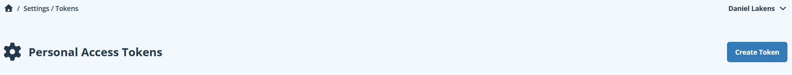
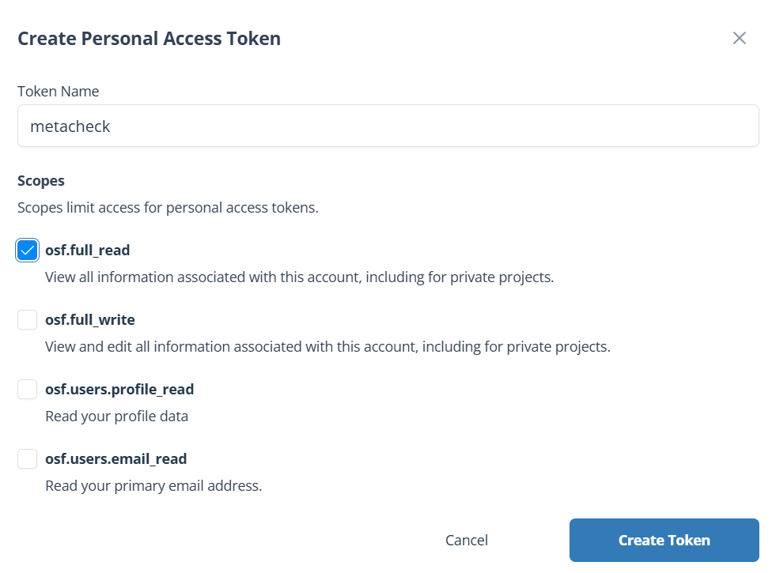
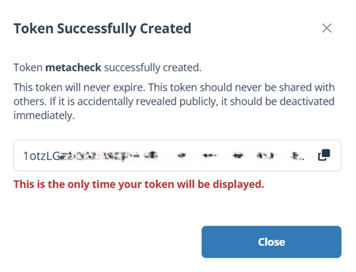
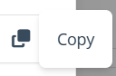
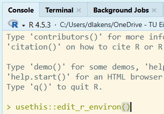
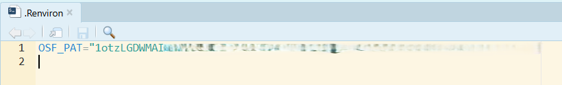
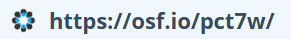

```{r, include = FALSE}
knitr::opts_chunk$set(
  collapse = TRUE,
  comment = "#>",
  eval = FALSE
)
```

The Center for Open Science recently announced that the Open Science Framework will no longer host closed repositories. It will continue to host open repositories, but will not accept new files. This means researchers who used the Open Science Framework to store closed repositories will need to download them, and host their files elsewhere in the future. This chapter explains how to use Metacheck to download all your OSF data onto your own computer, and how to check what you have before deciding what to do with it.

Where those files should go next is a separate question, taken up in [Uploading Files to Zenodo](uploading-to-zenodo.qmd). You do not need that chapter if you only want a copy of your own repositories.

## Downloading all your private Repositories from the Open Science Framework

The whole process has two steps:

1. Create an access token for the OSF.
2. Download your OSF projects onto your own computer.

## Before you start

You need R (version 4.3.0 or newer) and, ideally, RStudio. You also need the
metacheck package. The functions in this chapter are part of the development
version, so install that rather than the stable release. The Setting up
Metacheck chapter explains this in full; the short version is that the
development version is published on the scienceverse R-universe as a separate
package called `metacheck.dev`, built automatically from the `dev` branch. It is
supplied as a pre-compiled binary on Windows and macOS, so you do not need any
build tools:

``` r
install.packages("metacheck.dev",
  repos = c("https://scienceverse.r-universe.dev", "https://cloud.r-project.org"))
```

Because R-universe renames the package, you load it as `metacheck.dev`:

``` r
library(metacheck.dev)
```

Install *either* the stable `metacheck` *or* the development `metacheck.dev`,
and do not load both in the same session. Everything else in this chapter works
the same way whichever of the two you have installed.

Alternatively you can install from GitHub, which builds the package from source
and therefore needs a compiler (Rtools on Windows, the Xcode command-line tools
on macOS, the standard development tools on Linux):

``` r
install.packages("pak")
pak::pkg_install("scienceverse/metacheck@dev")
```

A source install keeps the name `metacheck`, so you load it with
`library(metacheck)`.

You can type commands into the **console**, which is the panel in RStudio where
R shows its output and waits for you to type, or in a new R file, where you can copy paste lines of code, and run them individually, or all together. When this chapter shows a line
like `osf_pat()`, type it into the console or your R file, and press Enter or CTRL+Enter on the line of the code to run it.

Load the package:

```{r}
library(metacheck)
```

## Step 1: Create your access token

An access token is a long string of letters and numbers that proves to a website
that a program is acting on your behalf. It works like a password that you give
to one specific program, and that you can revoke without changing your real
password.

You need one token for the OSF, created here. If you go on to upload the files
to Zenodo, that needs its own separate token, explained in [Uploading Files to
Zenodo](uploading-to-zenodo.qmd).

### Why you need an OSF token

Without a token, the OSF allows only **100 requests per hour**, only for public OSF projects. Listing all files in a large account uses far more than that, so a download will stop part way through.

With a token, you may make **10,000 requests per day**, and you can also reach
your own private projects, which are invisible without a Token.

### Creating the OSF token

Go to <https://osf.io/settings/tokens>. If you are not logged in, log in first
and then open that link again.

Click the **Create Token** button.

{fig-alt="The OSF personal access tokens settings page with a Create Token button"}

Give the token a name that will remind you what it is for, such as `metacheck`.
Then tick the **osf.full_read** scope. This lets the token read everything in
your account, including private projects, but not change anything.

{fig-alt="The Create Personal Access Token dialog with the name metacheck and the osf.full_read scope ticked"}

::: {.callout-tip}
## Which scope should you choose?

`osf.full_read` is enough for everything in this chapter, because you are only
reading from the OSF and writing to Zenodo. Only tick `osf.full_write` if you
intend to change things on the OSF, which metacheck does not do.
:::

Click **Create Token**. Your token now appears on screen.

{fig-alt="The OSF page showing a newly created personal access token"}

::: {.callout-important}
## You will only see this token once

If you navigate away without copying it, you cannot get it back, and you will
have to create a new one. Copy it now.
:::

Click the **Copy** symbol next to the token.

{fig-alt="The copy icon beside the token"}

A green bar appears briefly in the top right to confirm the copy succeeded.

### Storing the OSF token

Now store the token so that R finds it automatically every time it starts. R
reads a file called `.Renviron` when it starts, and anything in that file
becomes available to your session.

Type this in the R console and press Enter:

```{r}
usethis::edit_r_environ()
```

{fig-alt="The R console with usethis::edit_r_environ() typed in it"}

A file called `.Renviron` opens in the editor. Add this line, replacing the
placeholder with the token you copied. Keep the quotation marks:

```
OSF_PAT="paste-your-token-here"
```

{fig-alt="The .Renviron file open in RStudio showing the OSF_PAT line"}

Save the file with **Ctrl+S**, then restart R with **Ctrl+Shift+F10**. The
restart matters: `.Renviron` is only read when R starts, so the token does not
exist in your session until you restart.

Check that it worked:

```{r}
osf_pat()
```

This should print your token. If it prints `""` (two quotation marks with
nothing between them), the token is not being found. The usual causes are
forgetting to restart R, forgetting the quotation marks, or a missing blank line
at the end of the file.

::: {.callout-note}
## Using a token for one session only

If you would rather not store the token in a file, you can set it for the
current session:

```{r}
osf_pat("paste-your-token-here")
```

This is forgotten when you close R.
:::


## Step 2: Download your OSF projects

### Finding your OSF user ID

Your user ID is the five-character code in the address of your OSF profile page. Go to: `https://osf.io/profile` and it will be provided on the screen:

{fig-alt="Your OSF ID"}

If your profile is at `https://osf.io/pct7w`, your user ID is `pct7w`.

### Looking at what you have before downloading

It is worth seeing what is there before downloading anything. The code below retrieved all the OSF projects of Daniel Lakens. Unless you have an OSF personal access token of Daniel Lakens, you can only see his public projects. This request can take a while if you have many projects on the OSF:

```{r}
projects <- osf_user_projects("pct7w")
```

The code returns a table with one row per project and these columns:

| Column | Meaning |
|---|---|
| `osf_id` | The project's five-character OSF code |
| `name` | The project's title |
| `category` | What kind of node it is, usually `project` |
| `public` | `TRUE` if anyone can see it, `FALSE` if private |
| `osf_url` | The web address of the project |

::: {.callout-note}

## Components do not appear separately

An OSF project can contain components, which are sub-projects. These are not
listed separately, because downloading a project automatically brings its
components' files with it, however deeply they are nested.
:::

### Downloading a single project

You can download a single project, using the code from the `osf_id` column
in the table `projects` created above:

```{r}
# just one project, by its code
osf_file_download("8uqfb", download_to = "how_many_registered_studies_are_published")
```

The name you specify is the folder the download goes into, so make sure the name
is meaningful. Inside it, the project gets a folder named after its OSF ID, and
each component gets a folder named after the component's title with its own OSF
ID appended, so that two components sharing a title cannot collide and every
folder can be traced back to the component it came from. If you enter an ID that
does not exist, or one that has been deleted from the OSF, Metacheck will
provide a warning.

### While you are at it, why not check the repository?

You now have the whole project on your own computer. This is a good moment to
look at what you actually shared, because you are about to archive it somewhere
permanent, and it is much easier to fix a missing README or an undocumented
column now than after the files have a DOI.

Metacheck is designed to assist researchers though automated checks. One way it can do this is by asking users to upload a paper, and it will check if improvements can be made to how research is reported. But in the 0.2.0 version of metacheck, a range of new modules exist that allow users to check data and code in a folder, and automatically suggests improvements to the repository, data, and code. 

One line checks the folder you just downloaded:

```{r}
report_repository("how_many_registered_studies_are_published")
```

This writes a report `how_many_registered_studies_are_published_report.html` into your
working directory. Open it in a browser and read it as a list of suggestions: a
missing README to write, a column to document, a stray file to remove. It covers
what files are there, what the analysis code looks like, what is in the data,
and whether the data columns are documented anywhere. The [Creating a
Report](creating-a-report.qmd) chapter explains the function and its arguments
in full.

::: {.callout-important}
## Check for personal information before you upload, not after

Among these checks is a screen for columns that look like they hold email
addresses, IP addresses, names, or geographic coordinates. Some of your OSF
projects were private precisely because they contain such data. A file published
on Zenodo cannot be deleted, so look at this report before you upload anything.
:::

### Downloading everything

To download every project the account contains, give the user ID directly:

```{r}
result <- osf_file_download("pct7w", download_to = "my_osf_archive")
```

That is all you need: everything is downloaded, with no size limits, because
this function exists to download a repository in full.

The arguments you may want to change:

- `download_to` is the folder to save into. It is created if it does not exist.
  In this example the files go into the R working directory, in a new folder
  called `my_osf_archive`.
- `mode` decides how much work is done before downloading. See the next
  section; the default is right for archiving your own account.
- `max_file_size` and `max_download_size` are largest single file and largest
  total per project, in megabytes. Both are `NULL` by default, meaning no
  limit. Set them when you are looking at somebody else's repository and do
  not want to pull down their large files. Neither applies in the default
  `mode = "all"`, because there is no file list to filter.
- `metadata` also retrieves the parts of a project that are not files. It is
  `TRUE` by default; see the section on wikis and logs below.
- `max_folder_length` shortens folder names to a set number of characters. Set
  it if you are on Windows and the full paths would otherwise exceed the
  260-character limit. It has no limit by default.
- `ignore_folder_structure` puts every file into a single folder instead of
  reproducing the folders the project had. It is `FALSE` by default.
- `osf_pat` is your OSF token. You can leave it out if you stored the token in
  `.Renviron` as described above; passing it here sets it for the rest of the
  session.

::: {.callout-tip}
## Running it again

Each project is saved in a folder named after it, and running the same command
again reuses that folder, so nothing is duplicated into a second folder. Whether
the second run does less work depends on the mode. In `mode = "select"` it does:
files already on disk at the size the OSF reports are not fetched again, so an
interrupted download can simply be repeated and only what is missing is
retrieved. In the default `mode = "all"` it does not: that mode never lists the
files, so it has no way of knowing what a component should contain, and it
fetches every archive again. Use `mode = "select"` when the ability to resume
matters more to you than speed.
:::

::: {.callout-warning}

## This can take a long time

Downloading a whole account means listing every project and fetching every file.
For an account with a hundred projects this can take hours and use a lot of disk
space. Metacheck makes it easy to download only one of your projects, or a list of some of the projects. 
:::

### Downloading only some projects

Because `osf_user_projects()` returns an ordinary table, you can select whichever
subset you want and pass it straight back. This is the case that matters most
here: public repositories will remain available on the OSF, so the projects you
actually need to rescue are the private ones. The `public` column is `FALSE` for
those, so one line selects them:

```{r}
# download your private projects (as the OSF will no longer host them)
projects |>
  subset(public == FALSE) |>
  osf_file_download(download_to = "my_private_osf_archive")
```

### The `mode` argument

By default, `osf_file_download` will download all files from your repository.  This uses the default `mode = "all"` setting. The OSF can bundle a component's files into a single compressed archive, so metacheck asks for one archive per component and never lists the individual files. 

It is also possible to only download a selection of files. For example, if you already have a back-up of all stimuli, and their file-size is large, you might want to exclude these files from the download. Alternatively, you might want to reduce the size of all downloaded files by only downloading smaller files. 

The `mode = "select"` option lists every file through an individual API call to
the OSF. It retrieves information about each file (such as the name, the
extension, and the file size), which is what lets you select which files to
download, and what `max_file_size` and `max_download_size` filter on. Listing all
individual files makes downloading large repositories extremely slow. For
example, Daniel Lakens was a co-author on Many Labs 2 (OSF id `8cd4r`, 44
components and 1,907 files). Listing every file from the Many Labs 2 project
takes **63 minutes and 909 API requests**, and only then can files be
downloaded. Fetching the same project as archives using the default
`mode = "all"` setting retrieved all 1.9 GB of files in **under 7 minutes**.

There are two further values. `mode = "zip"` lists the files first, exactly like
`"select"`, but then transports whole components as archives; this makes fewer
requests than `"select"`, though it is not faster, and its `unzip` argument
decides whether the archives are unpacked after downloading or kept as zip
files. `mode = "files"` is an older name for `"select"` and is still accepted.

The code below makes these almost 2000 API calls, and subsequently downloads only files smaller than 1 MB, using the `mode = "select"` option. 

```{r}
# only files under 1 MB, each verified against its reported size
osf_file_download("8cd4r", download_to = "Many_Labs_2",
                    mode = "select", max_file_size = 1)
```

::: {.callout-note}
Files stored on a linked service such as GitHub or Dropbox are not in any OSF
archive, so those are still fetched one at a time. They are downloaded, and end up in their own sub-folder.
:::

::: {.callout-tip}
## You need a token to see your private projects at all

Without an OSF token, `osf_user_projects()` only lists the public projects, so
`subset(public == FALSE)` would return nothing. If that selection is empty and you were
expecting projects, check `osf_pat()` returns your token.
:::

The `|>` symbol is called a pipe. It takes whatever is on its left and passes it
as the first argument to the function on its right, which lets you read a
sequence of steps from top to bottom.

### Wikis, logs, and other things that are not files

An OSF project is often a record as much as data storage The wiki may hold the
protocol, the reasoning behind a decision, or the interpretation of the results,
and the activity log is the only account of when things changed. None of that is
a file, so downloading the files alone would lose it.

Metacheck therefore also retrieves this metadata in wikis and logs by default. Inside each project's folder
you will find an `_osf_metadata` folder containing:

| File | What it holds |
|---|---|
| `wiki_<name>.md` | One file per wiki page, as Markdown, so headings and lists survive. Only the current version is saved. |
| `logs.csv` | The project's activity log, one row per entry, with the date and what happened |
| `metadata.json` | Title, description, tags, licence, contributors with their ORCIDs, dates, citation, registrations and forks, exactly as the OSF returned them |
| `README.md` | A readable summary of all of the above |

A project with no wiki simply has no `wiki_` file, and the `README.md` says so
explicitly. This costs about four extra API requests per project. If you want the files
only, turn it off:

```{r}
osf_file_download("pct7w", download_to = "my_osf_archive", metadata = FALSE)
```

### Checking that the download worked

When the download finishes, every file that was supposed to arrive is checked
against your disk, and against the size the OSF said it should be. This matters
when you are archiving hundreds of files in one go.

What the result looks like depends on the mode, because the two modes know
different things.

In `mode = "all"` there is no file listing, so the table has **one row per
component**:

| Column | Meaning |
|---|---|
| `folder` | The folder this component was saved in, named after its title with its OSF code appended |
| `osf_project` | The component's OSF code |
| `osf_url` | The component's web address |
| `title` | The component's title on the OSF |
| `files` | How many files arrived in that folder |
| `bytes` | How much they add up to |
| `download_path` | The full path of the folder |
| `downloaded` | `TRUE` if the component's archive was retrieved |

```{r}
# keep the result of the download so you can look at it
# This also makes it easier to upload the files you downloaded to for example Zenodo
result <- osf_file_download("8uqfb", download_to = "how_many_registered_studies_are_published")

# how many files arrived in total, across all components
sum(result$files)

# any component whose archive could not be retrieved
subset(result, !downloaded)
```

In `mode = "select"` every file was listed, so the table has one row per file.
Alongside the file's own details
(`name`, `size`, `filetype`, `provider`, and `osf_id`, which is the *file's* ID
rather than the project's), these columns tell you what happened:

| Column | Meaning |
|---|---|
| `downloaded` | `TRUE` only when the file is really on disk. For files the OSF stores itself it must also be the size the OSF reported; a file that arrived truncated counts as not downloaded, because a half-file that looks complete is worse than an absent one. |
| `size_on_disk` | How large the file actually is, in bytes. Comparing it with `size` shows you why a file failed. |
| `attempted` | `FALSE` when *you* excluded the file with `max_file_size` or `max_download_size`. Those are not failures, so they are counted separately. |
| `path` | Where the file was saved, relative to `download_path` |
| `download_path` | The full path of the folder the project was saved in |
| `osf_project` | The OSF ID of the project the file came from |
| `osf_url` | The project's web address |

::: {.callout-note}
## Files on GitHub or Dropbox are checked differently

If a project links to an external service, the OSF reports the file size it
recorded the last time it looked at that service, and that figure goes stale as
soon as the file changes there. Those files are therefore checked for presence
only, not size. Files the OSF stores itself are checked both ways.
:::

To check everything arrived, keep the result of the download in a variable.
These columns only exist in `mode = "select"`, so this example asks for that
mode:

```{r}
checked <- osf_file_download("8uqfb", download_to = "how_many_registered_studies_are_published",
                             mode = "select")

# how many files arrived, out of those that were meant to
sum(checked$downloaded)
sum(checked$attempted)

# list anything that did not arrive
subset(checked, !downloaded & attempted)
```

If some files are missing, run the same download command again. Occasionally the
OSF refuses a request when many arrive at once; Metacheck waits and retries
twice automatically, but a file can still be missed on a busy day. In
`mode = "select"` the download resumes into the same folder, so only the missing
files are fetched, and you will see a message such as `54 of 57 files from pngda
are already on disk and were not downloaded again.`


## Where to put the files next

Your projects are now on your own computer. The next question is where they
should live, since the OSF will not go on hosting closed repositories.

We recommend Zenodo, and Metacheck can upload your downloaded projects to it
directly, taking the title, description, authors, ORCIDs, keywords and licence
from the original OSF project. That is the subject of its own chapter:
[Uploading Files to Zenodo](uploading-to-zenodo.qmd).

The `result` object returned by `osf_file_download()` is exactly what the upload
functions expect, so the two chapters fit together:

```{r}
result <- osf_file_download("pct7w", download_to = "my_osf_archive")
result |> zenodo_upload()
```

Before you upload anything, check what is in the files. A record published on
Zenodo cannot be deleted, and some of your OSF projects were private for a
reason. Run `report_repository()` on the download and read the
personal-information section of the report, as described earlier in this
chapter.

## When something goes wrong

**`osf_pat()` returns `""`.** R cannot find your token. Restart R, then check
`.Renviron` has the line `OSF_PAT="..."` with quotation marks and a blank line at
the end of the file.

**The download stops part way, or many files fail.** Usually the OSF rate limit.
Set an OSF token if you have not, and run the same command again with the same
`download_to`. The folder is reused either way. In `mode = "select"` files
already on disk at the right size are not fetched twice, so only the missing
ones are downloaded; in the default `mode = "all"` every archive is fetched
again, because that mode never listed the files and so cannot tell what is
already correct.

**Some files show `downloaded = FALSE`.** In `mode = "select"`, look at
`attempted`: if it is `FALSE` you excluded the file yourself with
`max_file_size` or `max_download_size`, and if it is `TRUE` the transfer
genuinely failed, so run the download again. In `mode = "all"`, `downloaded`
refers to a whole component, so a `FALSE` there means its archive could not be
retrieved.

**"could not be found on the OSF" or "has been deleted or withdrawn".** The
first means the ID does not exist, so check it against the project's web
address; the second means the project was on the OSF but has since been
removed, and its files cannot be recovered.

**A private project's files fail while its file names are listed.** The listing
and the download are separate requests, and only the listing was authorised.
Check `osf_pat()` returns your token, and that the token has the
`osf.full_read` scope.

For problems with the Zenodo upload itself, see the troubleshooting section of
the [Uploading Files to Zenodo](uploading-to-zenodo.qmd) chapter.
