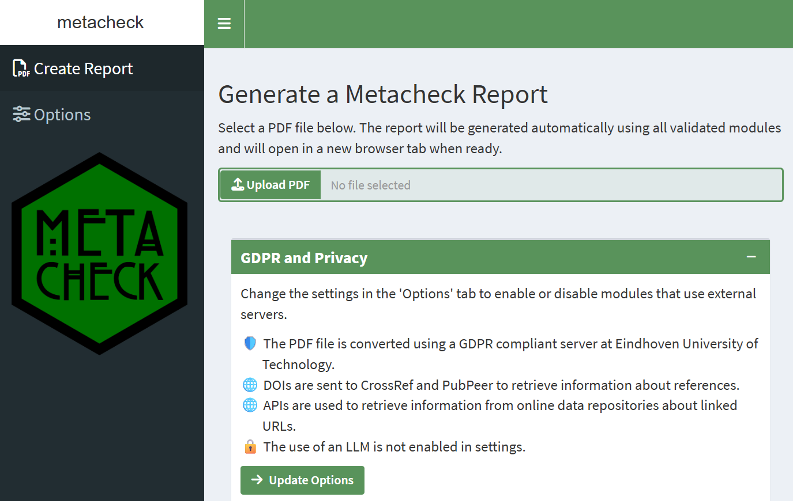
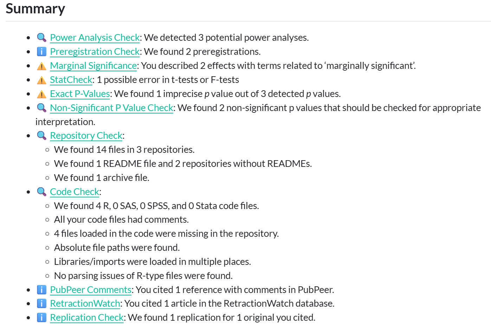
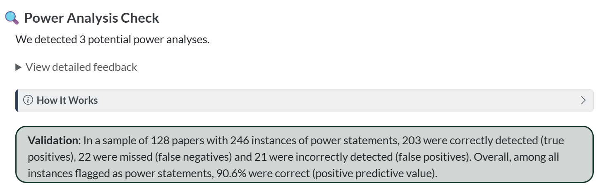

```{r, include = FALSE}
knitr::opts_chunk$set(
  collapse = FALSE,
  comment = "#>"
)
library(metacheck)
```


## Installation

Before you install Metacheck, you need two things on your computer:

1. **R**, version **4.3.0 or newer**. Download it for your operating system from [https://cran.r-project.org/](https://cran.r-project.org/) and install it with the default options.
2. **RStudio** Desktop (the free edition), from [https://posit.co/download/rstudio-desktop/](https://posit.co/download/rstudio-desktop/). RStudio is not strictly required, but we assume it throughout this book. Recent versions of RStudio also bundle the Quarto command-line tool, which Metacheck uses to generate reports.

With R and RStudio installed, the recommended way to install Metacheck is from the **scienceverse R-universe**. R-universe provides ready-to-use, pre-compiled versions of Metacheck for Windows and macOS, so you do **not** need any additional build tools, and installation is a single command. Open RStudio and run:

``` r
install.packages("metacheck",
  repos = c("https://scienceverse.r-universe.dev", "https://cloud.r-project.org"))
```

This tells R to look for Metacheck on the scienceverse R-universe first, and to pull any other required packages from the regular CRAN mirror. On Windows and macOS this installs binary versions of every package, so nothing is built from source and the installation works on a fresh machine without any extra setup. The download includes Metacheck's dependencies, so on a first installation it may take a few minutes.

After installation, you can load the Metacheck library.

```{r}
#| eval: false
library(metacheck)
```

::: {.callout-tip}
## Installing for a group

If you are installing Metacheck for a workshop or a class, ask participants to install R and RStudio and run the `install.packages()` command above *before* the session, and to confirm it works by running `library(metacheck)`. The R-universe install avoids the build-tools requirement that often trips people up, but downloading many packages over a single shared network connection at once can still be slow, so installing in advance avoids that bottleneck.
:::

### Installing the development version

Metacheck is under active development. The development version often has new modules or functions before they reach the stable release, but it may also have more bugs. There are two ways to install it.

#### From R-universe (recommended)

The development version is also published on the scienceverse R-universe as a separate package, **`metacheck.dev`**, built automatically from the `dev` branch. Like the stable install, this provides pre-compiled binaries, so it needs **no build tools**:

``` r
install.packages("metacheck.dev",
  repos = c("https://scienceverse.r-universe.dev", "https://cloud.r-project.org"))
```

Because R-universe renames the package, you load it as `metacheck.dev` rather than `metacheck`:

``` r
library(metacheck.dev)
```

The package's functions are otherwise identical, so the rest of this book applies unchanged. Note that you should install *either* the stable `metacheck` *or* the development `metacheck.dev`, not load both in the same session.

#### From GitHub (build from source)

You can also install directly from [GitHub](https://github.com/scienceverse/metacheck). This is only necessary if you need a change that has not yet been built on R-universe, or a development branch other than `dev`. Installing this way builds Metacheck from source, which requires a compiler toolchain that does not ship with R by default:

- **Windows:** Install **Rtools**, matching the version to your R version (Rtools44 for R 4.4.x, Rtools43 for R 4.3.x, and so on), from [https://cran.r-project.org/bin/windows/Rtools/](https://cran.r-project.org/bin/windows/Rtools/). Use the default options. This is a large download.
- **macOS:** Install the Xcode command-line tools by running `xcode-select --install` in the Terminal. For some packages you may also need a Fortran compiler, available from [https://mac.r-project.org/tools/](https://mac.r-project.org/tools/).
- **Linux:** Install the standard development tools (for example `build-essential` and `gfortran` on Debian/Ubuntu), along with the development versions of system libraries such as `libcurl`, `libxml2`, and `libssl`.

With the build tools in place, install the `pak` package and then install Metacheck from the `dev` branch:

``` r
install.packages("pak")
pak::pkg_install("scienceverse/metacheck@dev")
```

To install a different branch, change the name after the `@`. A source install keeps the package name `metacheck`, so you load it as usual with `library(metacheck)`.

```{r}
#| eval: false
library(metacheck)
```

You can launch a simple shiny app that creates a report from a PDF, with options to control what information is sent to or retrieved from external servers. This shiny app will run a fixed number of validated modules. It also provides R code to transition to R, where you can use more functions of Metacheck. The shiny app is the best way to get started with Metacheck.

``` r
metacheck::report_app()
```

{fig-alt="Screenshot of the Metacheck Shiny app"}

In the Shiny app you can upload a local file, and the app will automatically generate a report with the results for all validated modules. The report presents a general introduction about Metacheck, our values, and our approach to module validation. This is followed by a summary of all modules.

{fig-alt="Screenshot of the Metacheck report summary"}

Following the summary, you can browse each module. Modules are discussed in more detail in later chapters. Each module provides a summary, a dropdown field with detailed feedback, a section that can be expanded explaining how the module works, and information about how the module was validated. An example of this overview in the report for the power module is in the screenshot below: 


{fig-alt="Screenshot of the power module in the report"}


### Running locally for privacy

Metacheck has been developed so that it can run locally, without sending any information anywhere. This requires a bit more technical expertise, but it makes the tool available to editors or peer reviewers who are not allowed to upload submitted manuscripts to an external server.

When such privacy concerns are not an issue (for example when running Metacheck on a publicly available preprint) you can use online servers for specific tasks, such as converting a pdf to xml. This offers an easier user experience. 

Converting a PDF to text uses a GROBID server. By default Metacheck uses a [list of active servers](https://www.scienceverse.org/metacheck/convert.json) and chooses the first available — by default a GROBID server at Eindhoven University of Technology that meets GDPR requirements. If you cannot send manuscripts to an external server, you can run your own local GROBID server following instructions from <https://grobid.readthedocs.io/>. The easiest way is to use Docker. The following code installs GROBID 0.9.0.

``` bash
docker run --rm --init --ulimit core=0 -p 8070:8070 lfoppiano/grobid:0.9.0
```

If a local GROBID server is detected, Metacheck will use it automatically, so no manuscript text leaves your computer. The same principle applies to large language models: the recommended setup runs a model locally so no data is sent to an external service (see [Using Large Language Models](llms.qmd)).

See the [Reading in a Paper](reading-a-paper.qmd) chapter for the full details of converting and reading papers, including how to point `convert()` at a local server.

## Large language models

A few modules (notably [power](mod-power.qmd) and [prereg_check](mod-prereg-check.qmd)) can use a large language model to extract structured information from text. LLM use is **entirely optional and opt-in**, and the vast majority of modules work without any LLM. For how to turn LLM support on, choose a model, run one locally with Ollama, or use a cloud API, see [Using Large Language Models](llms.qmd).
