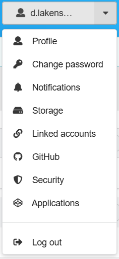
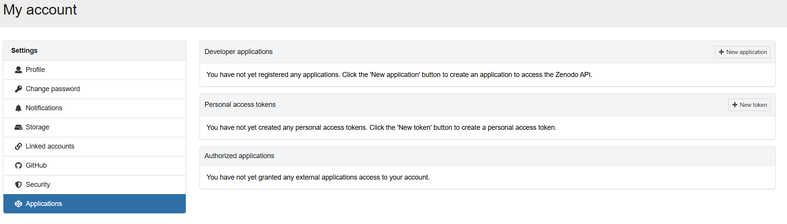
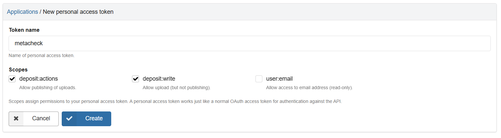
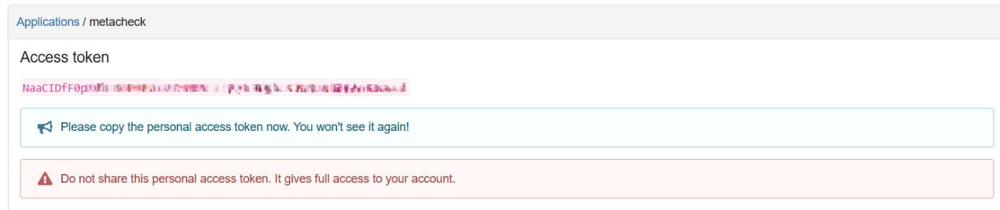

```{r, include = FALSE}
knitr::opts_chunk$set(
  collapse = TRUE,
  comment = "#>",
  eval = FALSE
)
```

Zenodo is a general-purpose data repository hosted by CERN and commissioned by the European Commission through the OpenAIRE project. It is a good place to archive research files permanently: records get a Digital Object Identifier, files can be reached through a public API, and it accepts anything you want to share rather than only certain disciplines.

This chapter explains how to upload files to Zenodo with Metacheck. The files can come from anywhere on your computer. If you are moving material off the Open Science Framework, the [Downloading an OSF Account](archiving-osf.qmd) chapter explains how to get your projects onto your own computer first; the result of that download can be passed straight to the functions here.


## Creating the Zenodo tokens

Zenodo runs two entirely separate websites:

- **The sandbox**, at <https://sandbox.zenodo.org>, which is for practising. It
  behaves exactly like the real thing but nothing on it is permanent, and its
  identifiers do not resolve publicly. It is periodically wiped. We strongly recommend making an account here as well, in addition to your normal Zenodo account, to test out whether you are correctly uploading your files, before you use the Metacheck functions to actually upload all your files automatically. 
  
- **The real Zenodo**, at <https://zenodo.org>, where deposits are permanent.

They have separate accounts and separate tokens. A token from one will not work
on the other. This is deliberate, and it is what makes it safe to practise.

Start with the sandbox. Register at <https://sandbox.zenodo.org/login/> — your
real Zenodo login does not work there, so you need a separate account. Then
follow exactly the same steps below, but on the sandbox website.

Log in to Zenodo. Logging in with your ORCID is usually easiest. From the
dropdown menu in the top right, choose **Applications**.

{fig-alt="The Zenodo account dropdown menu showing Profile, Change password, Notifications, Storage, Linked accounts, GitHub, Security, Applications, and Log out"}

You will see the applications page.

{fig-alt="The Zenodo applications page showing personal access tokens"}

Click **+ New Token**. Give it a name you will recognise, such as `metacheck`.
For the scopes, tick **deposit:write** and **deposit:actions**.

{fig-alt="The new personal access token page with the name metacheck and the deposit:actions and deposit:write scopes ticked"}

::: {.callout-tip}
## What the two Zenodo scopes do

`deposit:write` allows creating a deposit and adding files to it.
`deposit:actions` allows publishing it. You need both, even though you will
probably publish by hand through the website rather than from R.
:::

Click **Create**. The token appears in pink text.

{fig-alt="The Zenodo page showing a newly created personal access token in pink"}

Copy it and store it somewhere safe, then click **Save**. As with the OSF, you
cannot see this token again afterwards.

Add your tokens to `.Renviron` in the same way as before, using these names:

```
ZENODO_SANDBOX_PAT="paste-your-sandbox-token-here"
ZENODO_PAT="paste-your-real-zenodo-token-here"
```

Save, restart R, and check:

```{r}
zenodo_pat(sandbox = TRUE)   # your sandbox token
zenodo_pat(sandbox = FALSE)  # your real Zenodo token
```


## Practise on the sandbox first

`zenodo_upload()` sends files to the **sandbox** unless you tell it otherwise. Do a
complete run there first. Nothing on the sandbox is permanent, so you can make
mistakes freely. As you are automatically uploading files, and files on Zenodo can't be deleted, and get a DOI (which is costly, and makes the files permanent) you want to test if you are doing things correctly first.

::: {.callout-note}
## Check for personal data

Before uploading, check carefully that you are not about to publish data with
personally identifying information. You may have kept some projects private
precisely because they hold data you cannot share; that data is now on your own
computer, and must be removed before you upload anything to Zenodo.

Run `report_repository()` on the folder and read the personal-information
section of the report, described in [Creating a
Report](creating-a-report.qmd). It flags columns whose name or contents look
like email addresses, IP addresses, national identification numbers, geographic
coordinates, or open text entries that might name someone.

```{r}
report_repository("my_osf_archive/some_project")
```

Those flags are prompts to look, not proof of a disclosure: a column called
`phone_number` is flagged whether or not it holds one. Check each flagged column
yourself before deciding.
:::

Take the result of the download -- the `result` from the previous step --
and pass it straight on if all data can be shared publicly. Note that the folder name will be used on Zenodo as the file name by default, so make sure the file name is meaningful and clear.

```{r}
result |> zenodo_upload()
```

Or point at a specific folder. In the example repository, a folder called 'Non-Anonymous Data' is downloaded alongside the main public folder. This folder can't be shared. So we only select the folder with data that can be shared for upload to Zenodo. 

```{r}
zenodo_upload("how_many_registered_studies_are_published/An_Inception_Cohort_Study_Quantifying_How_Many_Registered_Studies_are_Published_8uqfb")
```

Before anything is sent, you will see a summary of how many folders and files
are involved, how large they are, whether they will be zipped, in how they will be zipped, which server they are going to, and whether they will be published. You then have to confirm. Nothing is uploaded until you do. This confirmation is skipped when R is running without a person at the keyboard, such as in a script started from the command line, where the upload simply proceeds. You can turn the question off yourself with `ask = FALSE`.

The other arguments you may want to change:

- `upload_type` is the kind of record Zenodo creates. It is `"dataset"` by
  default; `"publication"` and `"software"` are the other common choices.
- `upload_osf_metadata` decides whether the `_osf_metadata` folder that
  `osf_file_download()` saved inside each project is uploaded along with the
  files, so that the archive on Zenodo describes itself. It is `TRUE` by
  default. Setting it to `FALSE` deposits only the data files; the metadata is
  read either way, because that is where the deposit's title, licence and
  authors come from.
- `metadata` takes a list of extra fields to add to every deposit, overriding
  whatever was taken from the OSF.
- `max_file_size` is the largest file to upload, in megabytes. Anything larger
  is skipped and reported. It is `NULL` by default, meaning no limit.

## What ends up on Zenodo

One Zenodo deposit is created per folder. Where the folder came from an OSF
project, the details are taken from that project automatically:

- the project's title,
- its description,
- its contributors as the authors, with their ORCIDs where the OSF has them,
- its tags as keywords,
- its licence, and
- a link back to the original OSF project.

If the OSF project has no licence that Zenodo recognises, `cc-by-4.0` is used
and you are warned that this happened. You can choose a different one:

```{r}
result |> zenodo_upload(license = "cc0-1.0")
```

## Folders, and why Zenodo does not have any

Your download almost certainly has folders in it. A typical project looks
something like this:

```
Study/
  README.md
  Data/raw.csv
  Code/01_analysis.R
  Materials/stimuli.png
  Materials/instructions.mp4
```

Zenodo only stores files, and it has no option to create folders. In its own words, in answer to the question "Can I upload folders/directories?":

> Zenodo does not support uploading and organising files into
> folders/directories. Instead, you can create a ZIP archive and upload it, in
> which case Zenodo will display the file structure inside the ZIP.

A Zenodo record is a flat list of files and nothing else. So there are exactly
two things `zenodo_upload()` can do with your folders. It does the first of
them unless you say otherwise.

**Pack the folder into a ZIP archive.** This is what happens by default. The
folder is packed into an archive, which Zenodo displays with its structure
intact. Someone who wants to  access your files can download the files, unzip them, and they will have a local copy which has the original folder structure, so a re-user sees `Data/`, `Code/` and `Materials/` as you arranged them:

```{r}
result |> zenodo_upload()
```

The advantage is that your project arrives as a project rather than as an unstructured long list of files. The downside is that a reader who wants one small data file must download the whole archive. This could be a problem if you have a folder with 40GB of materials that you used in your study (e.g., video files), when all a re-user wants is to take a look at the data file and the code file. Metacheck solved this problem through it's `zenodo_file_download()` function, which is smart enough to be able to peek inside a zip file, and download only the file types you want (e.g., data and code files). Metacheck is able to do this because Zenodo is a really well-thought through data repository that allows users to download parts of .zip files. This function will be explained later.  

The second option is to upload the files individually, ignoring the folder structure. This might be fine if you are sharing just a few files, or many similar files. Set `as_zip = FALSE` and every file is uploaded on its own, with the folders dropped:

```{r}
result |> zenodo_upload(as_zip = FALSE)
```

The five files above would then appear on Zenodo as `01_analysis.R`,
`raw.csv`, `instructions.mp4`, `stimuli.png`, and `README.md`. Names are kept
short and readable. A folder name is only added when two files would otherwise
clash, so a project with `wave1/data.csv` and `wave2/data.csv` produces
`wave1__data.csv` and `wave2__data.csv` rather than one file is overwritten by the other.

The advantage is that a reader can see each file, preview it in the browser,
and download just the one they want. The cost is that the arrangement of your
project is gone, and a reader has to work out from the names alone which file
was data and which was a stimulus. For a small flat folder, where the structure
carries no meaning worth keeping, that is a reasonable trade-off.

## Splitting materials into their own archive

A single archive would be a poor default for a large project. Researchers shared data and code for people who want to re-analyze their data, and they share materials for researchers who want to replicate their study. These are two different use-cases. And as materials are often much larger than data files, `zenodo_upload()` by default creates two archives, one for **materials** and another for everything else. If there are no materials, only one zip file is created.

So the default upload produces two archives:

```
Study.zip             README.md, Data/raw.csv, Code/01_analysis.R
Study_materials.zip   Materials/stimuli.png, Materials/instructions.mp4
```

Both archives store the same `Study/` folder at the top, which is what makes it possible to unzip both files, and recreate the original folder structure, while also enabling re-users to only download one of the two archives, and have only the files they need. 

## Choosing what gets split

Files are sorted into six categories: `data`, `code`, `materials`,
`documentation`, `output`, and `unknown`. These are the same categories, worked
out by the same function, that the `repo_check()` function in Metacheck uses to classify files. The parameter `split_materials` says which of those categories to put in their own archive. It defaults to `"materials"`. You can change it. Set `split_materials = NULL` when the project is small enough that splitting only makes it harder to use:

```{r}
result |> zenodo_upload(split_materials = NULL)
```

Pass more than one category and each gets its
own archive, so a reader can take the data and code without your generated
figures and tables:

```{r}
result |> zenodo_upload(
  split_materials = c("materials", "output")
)
```

That produces `Study.zip`, `Study_materials.zip`, and `Study_output.zip`.
Unzipping all three still rebuilds the original folder exactly.

## Downloading Files from ZIP Archives

It is best practice to use the .zip format when archiving files, because it is possible for software to peek inside a .zip without downloading the entire file an unzipping it. On the Zenodo website, an archive is one item. A visitor cannot see what is inside it, cannot preview a single file in the browser, and cannot download one file on its own. Splitting the materials off reduces that cost but does not
remove it: the data and code archive is still all-or-nothing.

This is the strongest argument for `as_zip = FALSE`, and if the people you
expect to read your work will be clicking around the Zenodo page by hand, it is
a good reason to choose it.

For anyone working from R, however, metacheck removes the problem.
`zenodo_file_download()` takes an `unzip_types` argument, and when you use it,
files are read out of an archive **without downloading the archive**:

```{r}
# only the data files, out of whatever archives the record contains
zenodo_file_download("21918913", unzip_types = "data")
```

This works because of two facts about how ZIP archives and Zenodo happen to
fit together. A ZIP stores a listing of its contents at the end, and compresses
each file inside it separately rather than as one continuous stream. Zenodo
serves files over HTTP with byte-range support, meaning a program may ask for
particular stretches of a file instead of the whole thing. So metacheck reads
the listing from the end of the archive, works out where the files you asked
for begin and end, and requests only those stretches. Nothing else crosses the
network.

The saving is not marginal. Running the line above on that record, which is a
25.6 MB archive of an ecology study, writes 11 data files totalling 46 kilobytes.
The other 25.5 MB is never transferred.

Files keep the folders they had inside the archive, so what lands on your disk
looks like the project rather than a heap:

```
21918913/baumlab-Bruce_etal_2026_JAnimEcol-9fe2cfa/
  01_data/KI_Monitoring_SiteData.csv
  01_data/summarized_digitization_data.csv
  03_tables_figures/Table_1.csv
  ...
```

The categories are the same six used for splitting -- `data`, `code`,
`materials`, `documentation`, `output`, and `unknown` -- so you can ask for
whatever part you need, and combine them:

```{r}
# just the code, to see how an analysis was done
zenodo_file_download("21918913", unzip_types = "code")

# data and documentation together, so you get the codebook with the data
zenodo_file_download("21918913", unzip_types = c("data", "documentation"))
```

On the record used here, the second of those writes 13 files rather than 11.
The first writes only one, which is a useful thing to see: that archive
contains no analysis scripts at all, only an RStudio project file and a PDF of
the analysis. Asking for `"code"` correctly reports that there is almost none.
A small result is not necessarily a fault in the classification -- sometimes it
is telling you something about the repository.

`max_file_size` applies to each file inside the archive rather than to the
archive itself, so you can exclude anything unexpectedly large while still
taking everything else:

```{r}
# data files, but nothing above 5 MB
zenodo_file_download("21918913", unzip_types = "data", max_file_size = 5)
```

Note that `zenodo_file_download()` has different defaults from
`osf_file_download()`: its `max_file_size` is 10 MB and its `max_download_size`
is 100 MB, rather than no limit. This function is mainly used to look at
somebody else's record, where you rarely want their largest files by accident.
If you are retrieving a record in full, set both to `NULL`:

```{r}
zenodo_file_download("21918913", max_file_size = NULL, max_download_size = NULL)
```

Leaving `unzip_types` unset keeps the old behaviour: archives are downloaded
whole and left zipped.

::: {.callout-note}

## Nothing is lost when this does not work

Reading inside an archive depends on the server allowing range requests and on
the archive's listing being readable. When either fails, metacheck says so and
downloads the whole archive instead, exactly as it would have done otherwise.
The option can save you a download; it cannot cost you a file.
:::

None of this helps somebody browsing Zenodo in a web browser, so it does not
fully answer the objection. It does mean that the archive you upload stays
usable to anyone working in R, which is the audience most likely to want your
data and code rather than a look at your stimuli.

## Drafts, and publishing

Deposits are created as **drafts**. A draft is private, can be edited or
deleted, and does not have a permanent identifier yet. Nothing is published
unless you explicitly ask.

The function returns a table with a `url` for each deposit. Open those links,
check the files and the description are right, and then press Publish on the
Zenodo website when you are satisfied.

::: {.callout-important}
## Publishing on the real Zenodo cannot be undone

Once a record is published on zenodo.org it is permanent. It is given a DOI, and
neither the record nor the DOI can be deleted. Check your drafts carefully
before publishing, and practise on the sandbox first.
:::

You can publish from R by setting `publish = TRUE`, but the safer habit is to
review each draft on the website and publish by hand.

## Uploading to the real Zenodo

When a sandbox run has gone the way you expect, repeat it against the real
Zenodo by adding `sandbox = FALSE`:

```{r}
result |> zenodo_upload(sandbox = FALSE)
```

This still creates drafts, so you still have to publish each one yourself.

## The whole process in one place

Moving an OSF account to Zenodo, from start to finish. The first three steps are
covered in the [Downloading an OSF Account](archiving-osf.qmd)
chapter; the last two are this one.

```{r}
library(metacheck)

# 1. see what is there
projects <- osf_user_projects("pct7w")
projects

# 2. download the private ones -- everything, no size limits, the fast way
result <- osf_file_download(
  subset(projects, public == FALSE),
  download_to = "my_osf_archive"
)

# 3. check what you are about to share, before it becomes permanent
report_repository("my_osf_archive")

# 4. practise the upload on the sandbox
result |> zenodo_upload()

# 5. when that looks right, upload for real (still as drafts)
result |> zenodo_upload(sandbox = FALSE)
```

## When something goes wrong

**"No token found for the Zenodo sandbox".** The sandbox needs its own token
stored as `ZENODO_SANDBOX_PAT`, from an account registered at
sandbox.zenodo.org. A token from the real Zenodo will not work there.

**"Zenodo did not accept the token".** The token is for the other Zenodo server,
was typed incompletely, or lacks the `deposit:write` scope. Create a new one.

**A Zenodo deposit is titled after a folder, with "Unknown" as the author.** The
OSF details for that project could not be read, usually because it is private
and your token cannot see it. Correct the draft on Zenodo before publishing.

For problems with the OSF download itself — a missing token, a download that
stops part way, files that do not arrive — see the troubleshooting section of
the [Downloading an OSF Account](archiving-osf.qmd) chapter.

